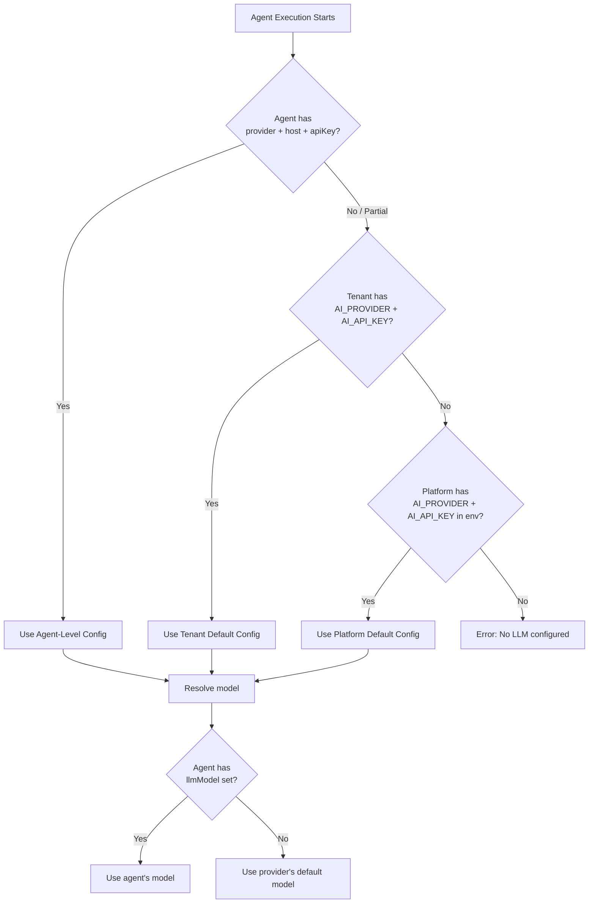
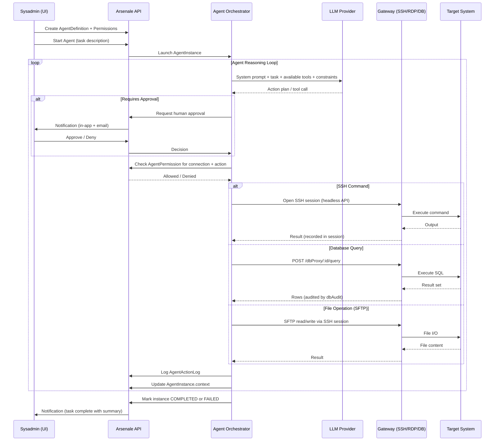
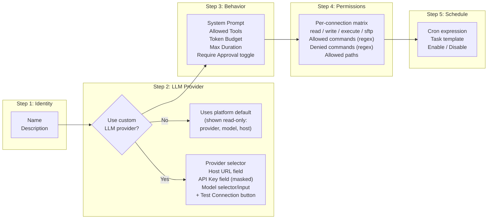
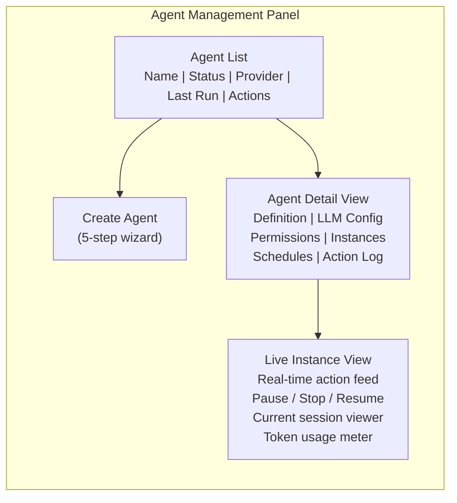

# Agent Orchestration Gateway

> **Status:** Future Update — This document describes the planned LLM Agent Orchestration Gateway for Arsenale. Agents are first-class tenanted entities that authenticate, connect, execute, and are audited exactly like human users.

## Overview

The Agent Orchestration Gateway enables sysadmins to create, manage, and schedule autonomous LLM-powered agents that operate on target systems through Arsenale's existing connection infrastructure. Agents connect to any gateway type (SSH, RDP, VNC, database), analyze user requests, plan actions against target systems, respect fine-grained permissions, and execute — all while being fully traceable and subject to the same security gates as human users.

### Design Principles

1. **Agents are humans** — Same auth flow, same audit trail, same security analysis (lateral movement, impossible travel, DLP, session recording)
2. **Per-agent LLM provider** — Each agent can override the platform default with its own provider, host, and API key
3. **Sysadmin control** — Full lifecycle management via GUI: create, configure, start, pause, stop, destroy, schedule
4. **Tenant isolation** — Agents are scoped to a tenant, can only access connections within that tenant
5. **Least privilege** — Per-connection capability matrix (read, write, execute, SFTP, allowed commands/paths)

## Current Platform Readiness

The platform is approximately **80% ready** for agent integration. The table below maps agent requirements to existing capabilities.

### Authentication & Identity — 90% Ready

| Agent Need | Current Capability | Gap |
|---|---|---|
| Agents authenticate like humans | JWT + token binding (IP+UA hash) | Need service account type (API key auth, no password) |
| Per-tenant scoping | Full multi-tenant isolation with `tenantId` on every resource | None |
| MFA gates | TOTP, WebAuthn, SMS — 3 methods | Agents need MFA bypass with compensating controls (API key + IP allowlist) |
| Session management | Concurrent limits, heartbeat, inactivity timeout, absolute timeout | Need agent-specific session policies |
| Token refresh | Automatic refresh token rotation with family detection | Works as-is for long-running agents |

### Authorization & Permissions — 85% Ready

| Agent Need | Current Capability | Gap |
|---|---|---|
| Fine-grained permissions | 11 permission flags + per-user overrides + 7-level role hierarchy | Need per-agent per-connection capability matrix (read/write/execute/directories) |
| Team-based access | 3-level team RBAC (VIEWER/EDITOR/ADMIN) | Works as-is — agents can be team members |
| Connection-level sharing | SharedConnection with READ_ONLY / FULL_ACCESS | Need granular operation permissions (which commands, which paths) |
| ABAC policies | `abac.service.ts` evaluates attributes at session start | Can be extended for agent-specific policies (time windows, command allowlists) |

### Gateway & Connection System — 95% Ready

| Agent Need | Current Capability | Gap |
|---|---|---|
| Connect to SSH | Full SSH via Socket.IO + SFTP + bastion tunneling | Need headless API (REST, no WebSocket/browser required) |
| Connect to RDP | Guacamole gateway with token-based sessions | Need programmatic screen reading (OCR or Guacamole recording stream) |
| Connect to VNC | Full VNC via Guacamole | Same as RDP — need programmatic interaction API |
| Connect to databases | DB_PROXY gateway (Go) with query/schema/explain APIs | Already has REST API (`/sessions/dbProxy/:id/query`) — nearly agent-ready |
| Zero-trust tunnels | WebSocket tunnel with binary frame multiplexing | Works as-is for agent traffic |
| Gateway routing | Load balancing (round-robin, least-connections), health checks | Works as-is |

### Audit & Traceability — 95% Ready

| Agent Need | Current Capability | Gap |
|---|---|---|
| Full action audit trail | 120+ audit action types, fire-and-forget, GeoIP enrichment | Add `actorType` field (`USER` / `AGENT` / `SYSTEM`) + `agentId` |
| Session recording | Asciicast (SSH) + Guac (RDP) with retention policies | Works as-is — agents get recorded like humans |
| Anomaly detection | Impossible travel + lateral movement detection | Need agent-tuned thresholds (agents may legitimately access many targets fast) |
| Database query audit | Full SQL logging, classification, table extraction | Works as-is |
| Security alerts | Notifications for suspicious activity | Add agent-specific alert types |

### Notifications — 80% Ready

| Agent Need | Current Capability | Gap |
|---|---|---|
| Notify sysadmin of agent actions | In-app + email + desktop push, 17 event types | Add agent lifecycle events (started, paused, failed, completed) |
| DND / quiet hours | Full timezone-aware quiet hours with security bypass | Works as-is |
| Per-type preferences | Per-user per-notification-type toggles | Add agent notification category |

### Scheduling — 60% Ready

| Agent Need | Current Capability | Gap |
|---|---|---|
| Cron-based agent execution | `node-cron` scheduler with validation | Currently hardcoded jobs — need dynamic user-defined schedules |
| Recurring tasks | Key rotation, LDAP sync, membership expiry | Need agent task scheduler with CRUD API |
| Job lifecycle (pause/resume/cancel) | Not implemented | Need full job state machine |

## Architecture

### High-Level Component Diagram

```mermaid
graph TB
    subgraph "New: Agent Orchestration Layer"
        AO[Agent Orchestrator Service]
        AP[Agent Permission Engine]
        AE[Agent Execution Runtime]
        AS[Agent Scheduler]
        AM[Agent Monitor]
        LR[LLM Provider Resolver]
    end

    subgraph "New: Agent Models"
        AgentDef[AgentDefinition<br/>name, llmProvider, llmHost<br/>encryptedApiKey, llmModel<br/>systemPrompt, tools, tenantId]
        AgentInst[AgentInstance<br/>status, startedAt, stoppedAt<br/>taskDescription, parentAgentId]
        AgentPerm[AgentPermission<br/>connectionId, capabilities<br/>allowedCommands, allowedPaths<br/>readOnly, maxDuration]
        AgentSched[AgentSchedule<br/>cronExpression, enabled<br/>nextRunAt, lastRunAt]
        AgentLog[AgentActionLog<br/>instanceId, action, input<br/>output, durationMs, status]
    end

    subgraph "Existing: Arsenale Platform"
        Auth[Auth Middleware]
        Perm[Permission Service]
        Conn[Connection Service]
        Sess[Session Service]
        Gate[Gateway Service]
        Audit[Audit Service]
        Notif[Notification Service]
        Vault[Vault Service]
        Sched[Scheduler Service]
    end

    AO --> Auth
    AO --> Perm
    AE --> Conn
    AE --> Sess
    AE --> Gate
    AE --> Vault
    AP --> Perm
    AM --> Audit
    AM --> Notif
    AS --> Sched
    LR --> AgentDef
```



### LLM Provider Resolution

Each agent can optionally specify its own LLM provider, host, and API key. When not set, the platform falls back through a three-tier resolution chain — consistent with Arsenale's existing config pattern (env var → DB → default).



**Resolution pseudocode:**

```typescript
function resolveLlmConfig(agent: AgentDefinition, tenant: Tenant): LlmConfig {
  return {
    provider: agent.llmProvider ?? tenant.aiProvider ?? config.ai.provider,
    host:     agent.llmHost     ?? tenant.aiHost     ?? config.ai.host,
    apiKey:   agent.encryptedApiKey
                ? decrypt(agent.encryptedApiKey)
                : tenant.encryptedAiApiKey
                  ? decrypt(tenant.encryptedAiApiKey)
                  : config.ai.apiKey,
    model:    agent.llmModel    ?? tenant.aiModel    ?? config.ai.model,
  };
}
```

**Partial overrides are supported.** A sysadmin can set only `llmModel` on an agent to override just the model while keeping the tenant's provider and API key.

## Data Model

### Entity Relationship Diagram

```mermaid
erDiagram
    Tenant ||--o{ AgentDefinition : owns
    User ||--o{ AgentDefinition : creates
    AgentDefinition ||--o{ AgentInstance : runs
    AgentDefinition ||--o{ AgentPermission : "has permissions"
    AgentDefinition ||--o{ AgentSchedule : "scheduled by"
    AgentPermission }o--|| Connection : "scoped to"
    AgentInstance ||--o{ AgentActionLog : "produces"
    AgentInstance ||--o{ ActiveSession : "opens sessions"
    AgentInstance }o--o| AgentInstance : "parent (sub-agents)"

    AgentDefinition {
        uuid id PK
        uuid tenantId FK
        uuid createdByUserId FK
        string name
        string description
        enum status "ACTIVE PAUSED DISABLED"
        text systemPrompt
        json toolConfig
        json globalConstraints "max_duration max_sessions token_budget"
        boolean requireApproval "human-in-the-loop gate"
        string llmProvider "nullable — anthropic openai azure_openai ollama"
        string llmHost "nullable — custom endpoint URL"
        string encryptedApiKey "nullable — AES-256-GCM"
        string encryptedApiKeyIv "nullable"
        string encryptedApiKeyTag "nullable"
        string llmModel "nullable — e.g. claude-sonnet-4-20250514"
        datetime createdAt
        datetime updatedAt
    }

    AgentPermission {
        uuid id PK
        uuid agentDefinitionId FK
        uuid connectionId FK
        json capabilities "read write execute sftp"
        json allowedCommands "regex allowlist"
        json deniedCommands "regex denylist"
        json allowedPaths "filesystem path restrictions"
        boolean readOnly
        int maxSessionDurationSec
        json dlpOverrides
    }

    AgentInstance {
        uuid id PK
        uuid agentDefinitionId FK
        uuid parentInstanceId "nullable — for sub-agents"
        enum status "PENDING RUNNING PAUSED STOPPED COMPLETED FAILED"
        text taskDescription
        json context "accumulated reasoning state"
        json executionPlan "planned actions"
        datetime startedAt
        datetime stoppedAt
        string stopReason
        int totalTokensUsed
        int totalActionsExecuted
    }

    AgentSchedule {
        uuid id PK
        uuid agentDefinitionId FK
        string cronExpression
        boolean enabled
        text taskTemplate "parameterized task description"
        datetime nextRunAt
        datetime lastRunAt
        uuid lastInstanceId FK
    }

    AgentActionLog {
        uuid id PK
        uuid instanceId FK
        string action "ssh_command db_query file_read file_write"
        text input
        text output "truncated for storage"
        int durationMs
        enum status "SUCCESS DENIED FAILED TIMEOUT"
        uuid sessionId "links to ActiveSession"
        datetime createdAt
    }
```



### Key Design Notes

- **LLM config fields live on `AgentDefinition`** (not a separate table) — all nullable. Avoids an extra join for every agent execution.
- **API key encrypted at rest** using AES-256-GCM, same `EncryptedField` pattern as connection credentials.
- **API key is write-only** — never returned in API responses, UI shows last 4 characters only (`sk-...XXXX`).
- **`AgentInstance.context`** accumulates the agent's reasoning state across tool calls, enabling pause/resume.
- **`parentInstanceId`** enables sub-agent spawning with permission inheritance (child never exceeds parent).

## Agent Execution Flow



## Agent Creation UI

### Wizard Steps



### Step 2 — LLM Provider Details

| UI Element | Default State | Custom State |
|---|---|---|
| Toggle | Off | On |
| Provider | Read-only chip showing platform default (e.g. `Anthropic`) | Dropdown: Anthropic, OpenAI, Azure OpenAI, Ollama, Custom |
| Host | Read-only chip (e.g. `api.anthropic.com`) | Text input — custom endpoint URL for self-hosted or Azure |
| API Key | Hidden (`Using platform key`) | Password input — masked, shows `sk-...XXXX` after save |
| Model | Read-only chip (e.g. `claude-sonnet-4-20250514`) | Text input / dropdown populated from provider after Test |
| Test Connection | Hidden | Button — sends minimal health-check to validate provider/host/key/model |

**Partial override:** All fields are independently optional. Setting only `Model` uses the platform's provider and key with a different model.

### Management Panel



### Agent Lifecycle Controls

| Control | Description | Available When |
|---|---|---|
| **Start** | Launch a new instance with a task description | Agent status = ACTIVE |
| **Pause** | Suspend execution at next safe point (between tool calls) | Instance status = RUNNING |
| **Resume** | Continue from paused state with preserved context | Instance status = PAUSED |
| **Stop** | Terminate immediately, close all sessions | Instance status = RUNNING or PAUSED |
| **Destroy** | Delete agent definition and all history | Agent status = any (confirmation required) |
| **Disable** | Prevent new instances, keep history | Agent status = ACTIVE |
| **Enable** | Re-activate a disabled agent | Agent status = DISABLED |

## Security Model

### Agents as First-Class Security Principals

Every security gate that applies to human users also applies to agents:

| Security Gate | Human User | Agent | Notes |
|---|---|---|---|
| JWT Authentication | Bearer token | Service account API key → JWT | Agents get JWT with `actorType: 'AGENT'` |
| Token Binding | IP + User-Agent hash | IP allowlist (no UA for API clients) | Compensating control |
| Tenant Isolation | `tenantId` on all queries | Same | No cross-tenant access |
| RBAC Permission Check | 11 flags + role hierarchy | Same + AgentPermission layer | Agents have additional per-connection restrictions |
| ABAC Policy Evaluation | Time windows, MFA step-up, IP rules | Same (minus MFA, plus command restrictions) | Agent-specific policy attributes |
| Rate Limiting | Per-IP, per-identity | Same | Agent-tuned limits configurable |
| Session Limits | Concurrent session cap | Same | Per-agent max concurrent sessions |
| Session Recording | Asciicast / Guac | Same | Agent sessions always recorded |
| DLP Enforcement | Copy/paste/upload/download | Same (applied to SFTP, clipboard-equivalent) | Agent file operations respect DLP |
| Lateral Movement Detection | N distinct targets in M minutes | Same — with agent-specific thresholds | Agents may need higher thresholds |
| Impossible Travel | Geolocation velocity check | Same — agents have fixed IP so rarely triggers | Still active as defense-in-depth |
| Audit Trail | 120+ action types | Same + `actorType: 'AGENT'` + `agentId` | Full traceability to agent and instance |
| Keystroke Inspection | SSH command monitoring | Same — applied to agent SSH commands | Block/alert policies apply |
| Database Firewall | Query pattern matching | Same | Agents subject to same SQL firewall rules |
| Data Masking | Column-level redaction | Same | Agents see masked data per policy |

### API Key Security

| Concern | Mitigation |
|---|---|
| At rest | AES-256-GCM encrypted, same as connection credentials |
| In transit | HTTPS only, never returned in API responses (write-only field) |
| In logs | Logger's `SENSITIVE_KEYS` patterns already catch `apiKey`, `api_key`, `token` |
| In audit | Config changes audited but key value redacted |
| Cross-tenant | Agent can only use connections within its tenant |
| Cost runaway | `tokenBudget` on AgentInstance — orchestrator tracks cumulative usage and hard-stops |
| Self-hosted LLM | `llmHost` supports custom URLs — enables air-gapped deployments |

## Notification Events

New notification types for agent lifecycle:

| Event | Severity | Bypass DND | Recipients |
|---|---|---|---|
| `AGENT_STARTED` | Info | No | Agent creator |
| `AGENT_PAUSED` | Info | No | Agent creator |
| `AGENT_COMPLETED` | Info | No | Agent creator |
| `AGENT_FAILED` | Warning | Yes | Agent creator + tenant admins |
| `AGENT_APPROVAL_REQUIRED` | Urgent | Yes | Agent creator |
| `AGENT_BUDGET_WARNING` | Warning | No | Agent creator (at 80% token budget) |
| `AGENT_BUDGET_EXHAUSTED` | Warning | Yes | Agent creator + tenant admins |
| `AGENT_PERMISSION_DENIED` | Warning | No | Agent creator |
| `AGENT_ANOMALY_DETECTED` | Critical | Yes | Tenant admins + security auditors |

## Implementation Plan

### Phase 0 — Foundation (Pre-requisites)

| # | Task | Effort | Depends On |
|---|---|---|---|
| 0.1 | Add `actorType` enum (`USER` / `AGENT` / `SYSTEM`) to `AuditLog` + `ActiveSession` | S | — |
| 0.2 | Add service account auth type (API key, no password, IP-bound) | M | — |
| 0.3 | Create headless SSH execution API (REST endpoint, no Socket.IO/browser) | M | — |
| 0.4 | Make scheduler service support dynamic user-defined cron jobs | M | — |

### Phase 1 — Agent Core

| # | Task | Effort | Depends On |
|---|---|---|---|
| 1.1 | Prisma schema: `AgentDefinition` (with nullable `llmProvider`, `llmHost`, `encryptedApiKey*`, `llmModel`), `AgentPermission`, `AgentSchedule`, `AgentInstance`, `AgentActionLog` | M | — |
| 1.2 | Agent CRUD service + REST API (encrypt API key on create/update, never expose to client) | M | 1.1 |
| 1.3 | LLM provider resolution service — three-tier fallback (agent → tenant → platform), provider factory for Anthropic/OpenAI/Azure/Ollama, health-check endpoint for "Test Connection" | M | 1.2 |
| 1.4 | Agent permission engine (check capabilities per connection per action, command regex matching) | L | 1.1, 0.2 |
| 1.5 | Agent orchestrator service (LLM reasoning loop using resolved config, tool dispatch, context accumulation) | XL | 1.3, 1.4, 0.3 |
| 1.6 | Agent instance lifecycle state machine (start, pause, resume, stop, timeout, token budget enforcement) | L | 1.5 |

### Phase 2 — Integration with Existing Systems

| # | Task | Effort | Depends On |
|---|---|---|---|
| 2.1 | SSH tool: execute commands via headless API, respect permission allowlists/denylists | L | 1.5, 0.3 |
| 2.2 | Database tool: query via DB proxy, respect firewall + masking policies | M | 1.5 |
| 2.3 | SFTP tool: file read/write/list with path restrictions from `AgentPermission` | M | 1.5 |
| 2.4 | Audit integration: all agent actions logged with `actorType=AGENT`, `agentId`, `instanceId` | M | 0.1, 1.5 |
| 2.5 | Notification integration: agent lifecycle events + anomaly alerts (9 new event types) | S | 1.6 |
| 2.6 | Vault integration: agents retrieve credentials through vault, never see plaintext keys | M | 1.5 |

### Phase 3 — Scheduling & Automation

| # | Task | Effort | Depends On |
|---|---|---|---|
| 3.1 | Agent scheduler: CRUD for cron-based agent runs with parameterized task templates | M | 0.4, 1.6 |
| 3.2 | Human-in-the-loop: approval gates for sensitive actions with notification + configurable timeout | L | 1.6, 2.5 |
| 3.3 | Sub-agent spawning: agents can create child agents with inherited but never escalated permissions | L | 1.6 |

### Phase 4 — GUI

| # | Task | Effort | Depends On |
|---|---|---|---|
| 4.1 | Agent list page (full-screen `Dialog` from `MainLayout`, per existing pattern with `SlideUp`) | M | 1.2 |
| 4.2 | Agent creation wizard (5-step: identity, LLM provider, behavior, permissions, schedule) | L | 1.2, 3.1 |
| 4.3 | Agent detail view (config tab, permissions tab, instance history, action log timeline) | L | 1.6 |
| 4.4 | Live instance viewer (real-time action feed via Socket.IO, pause/stop/resume controls, token meter) | L | 1.6 |
| 4.5 | Agent audit integration in existing tenant audit log panel (filter by `actorType`) | S | 2.4 |

### Phase 5 — Advanced: RDP/VNC Vision Agents

| # | Task | Effort | Depends On |
|---|---|---|---|
| 5.1 | RDP agent tool: screenshot capture from Guacamole stream + LLM vision analysis | XL | 1.5 |
| 5.2 | RDP agent tool: keyboard/mouse injection via Guacamole protocol commands | XL | 5.1 |
| 5.3 | VNC agent tool: same capabilities via VNC protocol | L | 5.1, 5.2 |

## Open Design Decisions

| # | Question | Recommendation | Rationale |
|---|---|---|---|
| 1 | Agent runtime — in-process vs. worker process/container? | In-process for Phase 1, worker isolation for Phase 3+ | Simpler to start; long-running agents risk memory leaks in shared process |
| 2 | RDP/VNC approach — vision-based vs. accessibility API? | Vision-based (screenshot + OCR + coordinate clicks) | Guacamole already supports screenshot capture; accessibility APIs are protocol-specific and fragile |
| 3 | Permission granularity — start coarse or fine? | Start with connection-level (read/write/execute), add command-level regex in Phase 2 | Avoids over-engineering; most initial use cases are SSH + DB |
| 4 | Cost controls — per-instance, per-agent, or per-tenant? | Per-instance hard limit + per-tenant soft limit with alerts | Prevents runaway single execution while allowing flexible budgets |
| 5 | Context persistence — in DB or external store? | JSON column on `AgentInstance` for Phase 1, consider Redis/gocache for Phase 3+ | DB is sufficient for single-instance; high-frequency updates benefit from cache layer |
| 6 | LLM provider abstraction — custom or existing SDK? | LangChain/Vercel AI SDK for provider normalization | Avoid reinventing provider adapters; these SDKs handle streaming, retries, token counting |

## Supported LLM Providers

The provider factory must support at minimum:

| Provider | `llmProvider` Value | `llmHost` Required | Notes |
|---|---|---|---|
| Anthropic | `anthropic` | No (default: `api.anthropic.com`) | Claude models, tool use native |
| OpenAI | `openai` | No (default: `api.openai.com`) | GPT models, function calling |
| Azure OpenAI | `azure_openai` | Yes (Azure endpoint URL) | Requires deployment name in model field |
| Ollama | `ollama` | Yes (e.g. `http://localhost:11434`) | Self-hosted, air-gapped deployments |
| Custom OpenAI-compatible | `openai_compatible` | Yes (any URL) | vLLM, LiteLLM, LocalAI, etc. |

## Integration with Infrastructure Roadmap

When the platform decomposes into control-plane / data-plane (per `infrastructure-roadmap.md`), the Agent Orchestration Gateway naturally becomes a **control-plane service**:

- **Agent Orchestrator** → control-plane (manages lifecycle, talks to LLM)
- **Agent Execution Runtime** → data-plane (opens sessions through gateways)
- **Agent Monitor** → control-plane (audit, notifications, anomaly detection)
- **Agent Scheduler** → control-plane (cron management)

This alignment means the agent system will benefit from horizontal scaling of the data-plane without architectural changes.
