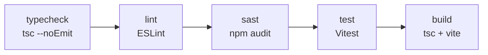
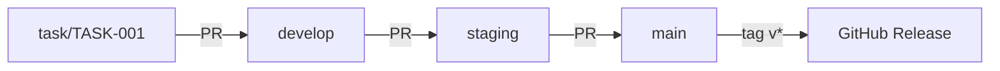

# Development

## Monorepo Structure

```
arsenale/
├── server/                    # Express API (TypeScript, CommonJS)
│   ├── src/
│   │   ├── index.ts          # Entry point (auto-migrate, HTTP, Socket.IO, guacd)
│   │   ├── app.ts            # Express middleware + route mounting
│   │   ├── routes/           # 32 route files
│   │   ├── controllers/      # 30 controller files
│   │   ├── services/         # 53 service files
│   │   ├── middleware/       # 19 middleware files (auth, CSRF, rate limits)
│   │   ├── socket/           # 5 Socket.IO handler files
│   │   ├── types/            # Shared TypeScript types
│   │   └── config/           # Passport, auth config
│   └── prisma/
│       └── schema.prisma     # 25+ data models
├── client/                    # React 19 SPA (TypeScript, ESM/Vite)
│   ├── src/
│   │   ├── main.tsx          # Entry point
│   │   ├── App.tsx           # Route definitions
│   │   ├── api/              # 31 API modules
│   │   ├── store/            # 15 Zustand stores
│   │   ├── pages/            # 10 page components
│   │   ├── components/       # 100+ UI components
│   │   ├── hooks/            # 12 custom hooks
│   │   ├── utils/            # Utility functions
│   │   ├── theme/            # Multi-theme definitions
│   │   └── constants/        # Terminal themes, RDP/VNC defaults
│   └── vite.config.ts        # Proxy, PWA, chunk splitting
├── tunnel-agent/              # Zero-trust tunnel agent (TypeScript, CommonJS)
├── extra-clients/
│   └── browser-extensions/   # Chrome Manifest V3 extension
├── ssh-gateway/               # SSH bastion Dockerfile
├── docker/                    # guacd, guacenc Dockerfiles
├── .github/workflows/        # 14 CI/CD workflows
├── compose.yml                # Production Docker stack
├── compose.dev.yml            # Development Docker stack
├── .env.example               # Environment template
├── eslint.config.mjs          # Root ESLint flat config
├── Makefile                   # Development shortcuts
└── package.json               # Workspace root
```

## Local Development

### Quick Start

```bash
npm install
cp .env.example .env
npm run predev && npm run dev
```

### Available Commands

| Command | Purpose |
|---------|---------|
| `npm run predev` | Start Docker containers + generate Prisma client |
| `npm run dev` | Run server (:3001) + client (:3000) concurrently |
| `npm run dev:server` | Server only (tsx watch, hot reload) |
| `npm run dev:client` | Client only (Vite, proxies to :3001) |
| `npm run build` | Build all workspaces |
| `npm run build -w server` | Build server only (tsc) |
| `npm run build -w client` | Build client only (Vite) |
| `npm run verify` | Full pipeline: typecheck → lint → audit → test → build |
| `npm run typecheck` | TypeScript check (all workspaces, no emit) |
| `npm run lint` | ESLint (all workspaces) |
| `npm run lint:fix` | ESLint with auto-fix |
| `npm run sast` | npm audit (dependency scan) |
| `npm run db:generate` | Regenerate Prisma client types |
| `npm run db:push` | Push schema changes (no migration file) |
| `npm run db:migrate` | Create + run migration files |
| `npm run docker:dev` | Start dev Docker containers |
| `npm run docker:dev:down` | Stop dev Docker containers |

### Makefile Shortcuts

```bash
make full-stack      # npm install + run server + client
make server-dev      # Server with tsx watch
make server-debug    # Server without watch
make client-dev      # Vite dev server
make migrate-dev     # Prisma migrate dev
make prisma-studio   # Open Prisma Studio
```

## Code Quality

### ESLint Configuration

Root `eslint.config.mjs` (ESM flat config) applies to all workspaces:

- **TypeScript**: Strict config (`@typescript-eslint/recommended`)
- **Security**: `eslint-plugin-security` (OWASP detection, object-injection disabled)
- **React**: `react-hooks` + `react-refresh` rules
- **Server**: Warns on `console` usage
- **Tests**: Relaxed `@typescript-eslint` rules

Ignored paths: `dist/`, `node_modules/`, `server/src/generated/`, `client/dist-node/`

### TypeScript Configuration

| Workspace | Target | Module | Key Settings |
|-----------|--------|--------|-------------|
| Server | ES2022 | CommonJS | Strict, source maps, declarations |
| Client | ES2022 | ESNext (bundler) | Strict, react-jsx, isolated modules |
| Browser Extension | ES2022 | ESNext | Same as client + Chrome types |
| Tunnel Agent | ES2022 | CommonJS | Same as server |

### Testing

Tests use **Vitest** in both server and client workspaces:

```bash
npm run test                    # All workspaces
npm run test -w server          # Server tests only
npm run test -w client          # Client tests only
```

Test files: 16 total across workspaces.

### Verification Pipeline

`npm run verify` runs these steps sequentially (all must pass before closing any task):



## Branch Strategy

| Branch | Purpose |
|--------|---------|
| `main` | Production (protected) |
| `develop` | Integration branch |
| `staging` | Pre-production testing |
| `task/<TASK-CODE>` | Feature/fix branches (created by `/task-pick`) |
| `release/<version>` | Release preparation |

### Workflow



1. Tasks create branches from `develop` via `/task-pick`
2. Pull requests target `develop`
3. `develop` merges to `staging` for pre-production testing
4. `staging` merges to `main` for production release
5. Version tags (v*) trigger CI/CD builds and GitHub Releases

## Key Development Patterns

### File Naming Conventions

| Layer | Pattern | Example |
|-------|---------|---------|
| Server routes | `*.routes.ts` | `auth.routes.ts` |
| Server controllers | `*.controller.ts` | `connection.controller.ts` |
| Server services | `*.service.ts` | `encryption.service.ts` |
| Server middleware | `*.middleware.ts` | `auth.middleware.ts` |
| Client stores | `*Store.ts` | `authStore.ts` |
| Client API | `*.api.ts` | `connections.api.ts` |
| Client hooks | `use*.ts` | `useAuth.ts` |

### Full-Screen Dialog Pattern

Features overlaying the dashboard use full-screen MUI `Dialog` components rendered from `MainLayout`, never separate page routes. This preserves active RDP/SSH sessions.

```typescript
// In MainLayout:
const [settingsOpen, setSettingsOpen] = useState(false);

// Dialog component:
<Dialog fullScreen open={open} onClose={onClose} TransitionComponent={SlideUp}>
  <AppBar position="static" sx={{ position: 'relative' }}>
    <Toolbar variant="dense">
      <IconButton onClick={onClose}><CloseIcon /></IconButton>
      <Typography>Settings</Typography>
    </Toolbar>
  </AppBar>
  <Box sx={{ flex: 1, overflow: 'hidden', display: 'flex' }}>
    {/* Content */}
  </Box>
</Dialog>
```

### API Error Handling

Use `extractApiError(err, fallbackMessage)` from `client/src/utils/apiError.ts` for API error extraction. For dialog forms, use the `useAsyncAction` hook.

### UI Preferences Persistence

All UI layout state persisted via `uiPreferencesStore` (Zustand + localStorage key `arsenale-ui-preferences`). Never use raw `localStorage` for UI preferences.

### Environment Variable Loading

The `.env` file lives at the monorepo root. Prisma CLI commands run from `server/` but `server/prisma.config.ts` resolves `.env` to `../.env`. Never create `server/.env`.

## Documentation

Documentation lives in `docs/` and is generated via `/docs generate`. Keep `docs/rag-summary.md` in sync when features change. See [Documentation Index](index.md).
