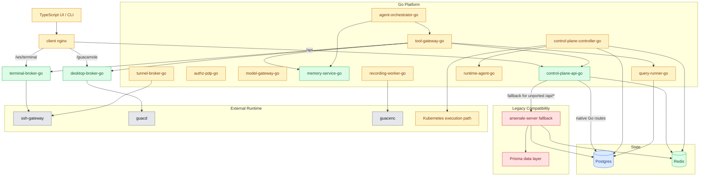
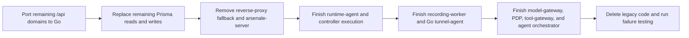

## Purpose

This file is the continuity handoff for the Arsenale backend migration from the legacy Node/Prisma monolith to the Go control plane and Go runtime services.

Use this document as the first reference in a new chat before continuing the refactor.

## Snapshot

- Repository root: `/home/daniele/Documents/Repos/arsenale`
- Active branch at handoff time: `develop`
- Last pushed commit: `25440e4e`
- Remote status at handoff time: pushed to `origin/develop`
- Working tree at handoff time: clean
- Runtime status at handoff time: healthy mixed-mode stack
- Important truth: the application is **not fully converted yet**

## Current Architecture Status



## What Is Already True

### Go owns the public edge

- `/api` now enters through `control-plane-api-go`, not directly through the Node server.
- Unported routes still fall through the internal reverse proxy in `backend/cmd/control-plane-api/legacy_proxy.go`.
- `/ws/terminal` already goes to `terminal-broker-go`.
- `/guacamole` already goes to `desktop-broker-go`.

### Go owns these major runtime paths

- Browser SSH data plane through `terminal-broker-go`
- Browser desktop transport through `desktop-broker-go`
- Most database runtime through `query-runner-go`
- Redis coordination instead of the old `gocache`
- No live Socket.IO dependency on the critical runtime path

### Latest completed route slice

The latest meaningful migration slice is native Go support for:

- `POST /api/sessions/ssh`

Implemented in:

- `backend/internal/sshsessions/service.go`
- `backend/internal/sshsessions/handlers.go`
- `backend/internal/sshsessions/access.go`
- `backend/internal/sshsessions/credentials.go`
- `backend/internal/sshsessions/gateway.go`
- `backend/internal/sshsessions/policy.go`
- `backend/internal/sshsessions/grants.go`
- `backend/internal/sshsessions/lateral.go`
- `backend/cmd/control-plane-api/runtime.go`
- `backend/cmd/control-plane-api/routes_sessions.go`

What that Go SSH session path now handles:

- public SSH session creation
- owner, team, and shared inline credential decryption
- domain credential mode
- bastion and managed SSH gateway resolution
- tunnel-backed SSH gateway proxying through `tunnel-broker`
- terminal grant issuance and websocket URL response
- stale SSH session replacement and active-session creation

What still falls back for that domain:

- legacy-only secret and external-vault-backed credential paths that still require Node behavior

## Native Go Route Surface: Confirmed Areas

The route surface below is confirmed to be native in Go based on the migration work completed so far. Some families are partial, not full replacements.

### Public and health

- `/api/health`
- `/api/ready`
- `/api/setup/status`
- `/api/setup/db-status`

### Auth and user account

- `/api/auth/config`
- `/api/auth/login`
- `/api/auth/refresh`
- `/api/auth/logout`
- `/api/auth/register`
- `/api/auth/verify-totp`
- parts of `/api/auth/oauth/*`
- large parts of `/api/user/*`
- multiple `/api/user/2fa/*` status endpoints

### Sessions and runtime-related APIs

- `/api/sessions/ssh`
- `/api/sessions/ssh-proxy/status`
- `/api/sessions/ssh-proxy/token`
- `/api/sessions/active`
- `/api/sessions/count`
- `/api/sessions/count/gateway`
- `POST /api/sessions/{sessionId}/terminate`
- large parts of `/api/sessions/database/*`

### Resource and tenant APIs

- large parts of `/api/connections/*`
- `/api/folders/*`
- `/api/files/*`
- `/api/tabs/*`
- large parts of `/api/tenants/*`
- read-heavy `/api/teams/*`
- `/api/gateways` read slice

### Governance and operations

- read-heavy `/api/audit/*`
- full `/api/db-audit/*` policy and read slice
- `/api/checkouts/*`
- `/api/rdgw/*`
- parts of `/api/admin/*`
- `/api/admin/system-settings/*`
- `/api/cli/*` device auth slice

### Vault, secrets, sync, and share

- `/api/vault/status`
- `/api/vault/auto-lock`
- `/api/vault/lock`
- `/api/vault/reveal-password`
- `/api/vault-folders/*`
- `/api/secrets/counts`
- `/api/secrets/tenant-vault/status`
- `/api/share/{token}/info`
- `POST /api/share/{token}`
- `/api/vault-providers/*`
- `/api/sync-profiles/*`
- `/api/recordings/*`

## Legacy Surface Still Blocking Completion

These areas still need migration or deeper parity work before Node and Prisma can be removed.

### Advanced auth and federation

- full SAML flow parity
- full OAuth callback and account-link branches
- verify-email, forgot-password, reset-password parity
- full MFA challenge flows, including WebAuthn and SMS mutation paths
- any remaining registration branches still falling through the legacy proxy

### Vault and secrets

- vault unlock and full recovery flow parity
- remaining secrets CRUD and password-rotation execution APIs
- legacy secret-backed credential usage still embedded in some session flows

### Connections and gateways

- remaining connection CRUD, sharing, import, and export branches
- gateway write, deploy, instance, log, template, scale, and lifecycle routes
- any remaining gateway orchestration still owned by legacy Node logic

### Sessions, database, and AI

- remaining database public controller flows not yet natively served by Go
- DB tunnel and other legacy session helpers still mounted in `server/src/app.ts`
- `/api/ai` route family

### Integrations and misc

- any remaining `ldap`, `geoip`, `external-vault`, and sync execution branches not yet ported
- any route that is still only available through the reverse proxy fallback

### Structural blockers

- Prisma is still present as the legacy data layer for unported domains
- `arsenale-server` is still in the live topology
- `control-plane-controller-go` is not yet the only reconcile loop
- `runtime-agent-go` is not yet the full Docker/Podman/Kubernetes executor
- `recording-worker-go` is not yet the final recording orchestrator
- the tunnel-agent conversion to Go is still unfinished
- the agent plane is still foundational, not final

## Legacy Node Route Inventory

The authoritative legacy inventory still starts from:

- `server/src/app.ts`

Mounted legacy families there include:

- `setup`
- `auth`
- `auth/saml`
- `vault`
- `connections`
- `folders`
- `sharing`
- `sessions`
- `sessions/db-tunnel`
- `user`
- `user/2fa`
- `files`
- `audit`
- `notifications`
- `tenants`
- `teams`
- `admin`
- `gateways`
- `tabs`
- `secrets`
- `vault-folders`
- `share`
- `recordings`
- `geoip`
- `ldap`
- `sync-profiles`
- `vault-providers`
- `access-policies`
- `checkouts`
- `sessions/ssh-proxy`
- `rdgw`
- `cli`
- `sessions/database`
- `db-audit`
- `secrets` password-rotation routes
- `keystroke-policies`
- `ai`
- `admin/system-settings`
- health routes

Treat `server/src/app.ts` as the source of truth for what still exists on the legacy side, and `backend/cmd/control-plane-api/routes*.go` as the source of truth for what has been ported.

## Ongoing Engineering Rules

These rules must continue in future refactor work.

### 1. Do not add new backend logic to Node or Prisma

If new backend behavior is needed, add it only to Go.

### 2. Split large Go backend files by purpose

This is now an explicit standing rule.

Do not allow new Go monolith files to form. Split by responsibility, for example:

- `handlers.go`
- `reads.go`
- `mutations.go`
- `helpers.go`
- domain-specific files like `credentials.go`, `gateway.go`, `policy.go`

Packages already split this way include:

- `backend/internal/users`
- `backend/internal/dbauditapi`
- `backend/internal/authservice`
- `backend/internal/tenants`
- `backend/internal/teams`
- `backend/internal/vaultapi`
- `backend/internal/checkouts`
- `backend/internal/sshsessions`

Continue this pattern as more packages are touched.

### 3. Keep Go as the public front door

All public browser and CLI traffic should continue to enter through Go first, even when fallback is temporarily needed.

### 4. Verify every migration slice before moving on

Do not stack multiple unverified route migrations and hope they work together later.

## Verification Loop

Run this exact loop after each meaningful migration slice.

```bash
cd /home/daniele/Documents/Repos/arsenale/backend && go test ./...
npm --prefix /home/daniele/Documents/Repos/arsenale/server run build
npm --prefix /home/daniele/Documents/Repos/arsenale/client run build
podman compose -f /home/daniele/Documents/Repos/arsenale/docker-compose.yml up -d --build control-plane-api-go
/home/daniele/Documents/Repos/arsenale/scripts/dev-api-acceptance.sh
cd /home/daniele/Documents/Repos/arsenale/deployment/ansible && timeout 300 ansible-playbook playbooks/deploy.yml -e arsenale_env=development --start-at-task 'Run development container health checks after bootstrap'
```

Known good state at handoff time:

- `go test ./...` passed
- Node build passed
- client build passed
- `./scripts/dev-api-acceptance.sh` ended with `acceptance-ok`
- Ansible post-bootstrap verification was green

## How To Confirm A Route Is Truly Native In Go

Do not trust assumptions. Confirm it.

### Check 1: hit the public edge

Use the public ingress, not only the Go service port:

```bash
curl -k https://localhost:3000/api/health
```

### Check 2: inspect Go API logs

```bash
podman logs --tail 200 arsenale-control-plane-api-go
```

Useful route-specific check:

```bash
podman logs --tail 200 arsenale-control-plane-api-go | rg '/api/sessions/ssh'
```

### Check 3: watch for fallback behavior

If the route is not mounted natively, it will be handled through the reverse proxy in:

- `backend/cmd/control-plane-api/legacy_proxy.go`

The goal is to make that fallback empty.

## Recommended Next Steps

The next work should follow this critical path.



### Priority 1: drain the remaining `/api` fallback surface

Focus on the biggest remaining legacy domains first:

- advanced auth and federation
- secrets and vault recovery branches
- remaining connections and gateway write flows
- remaining session and DB tunnel flows
- AI routes

### Priority 2: retire Prisma

- freeze `server/prisma/schema.prisma`
- move remaining live reads and writes to Go stores and SQL migrations
- stop relying on generated Prisma client behavior for public paths

### Priority 3: remove `arsenale-server`

Only after the fallback surface is empty:

- remove Node from Compose
- remove Node from Ansible deployment
- remove Node from client/API upstream assumptions
- then archive or delete the legacy workspace

### Priority 4: finish the infra end-state

- make `runtime-agent-go` a real executor
- make `control-plane-controller-go` the only reconcile loop
- finish Kubernetes execution under the same contract
- finish `recording-worker-go`
- port the tunnel-agent to Go

### Priority 5: finish the agent plane

- complete `model-gateway-go`
- replace bootstrap policy in `authz-pdp-go`
- keep all agent actions behind `tool-gateway-go`
- finish approval and execution-grant flow

## Suggested Resume Checklist For The Next Chat

1. Read this file first.
2. Confirm the current branch and commit.
3. Re-run the verification loop once before making changes.
4. Inspect `server/src/app.ts` for the next legacy family to remove.
5. Inspect `backend/cmd/control-plane-api/routes*.go` to see whether that family already has partial Go coverage.
6. Before editing, split any touched oversized Go package by purpose.
7. Implement one route family at a time.
8. Verify through public edge requests and `arsenale-control-plane-api-go` logs.
9. Only then move to the next family.

## Stop Conditions

Do not claim the refactor is complete until all of these are true:

- no `arsenale-server` container in the live topology
- no Prisma in active runtime or build path
- no legacy reverse-proxy fallback left in `control-plane-api-go`
- SSH, RDP/VNC, DB, secrets, gateways, recordings, and admin flows are Go-owned
- Docker, Podman, and Kubernetes are reconciled through the Go controller/runtime path
- failure tests pass for broker restarts, Redis recovery, controller/runtime-agent restart, and tunnel reconnect

## Final Reminder

The migration is advanced, but it is still a mixed-mode system.

Do not start a new chat assuming the application is already fully converted. It is not. The correct next move is to keep draining legacy route families from the Go edge, keep splitting Go packages by responsibility, and only then remove Prisma and the Node server.
